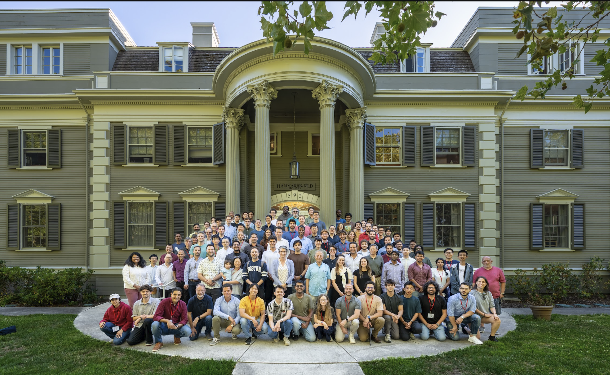
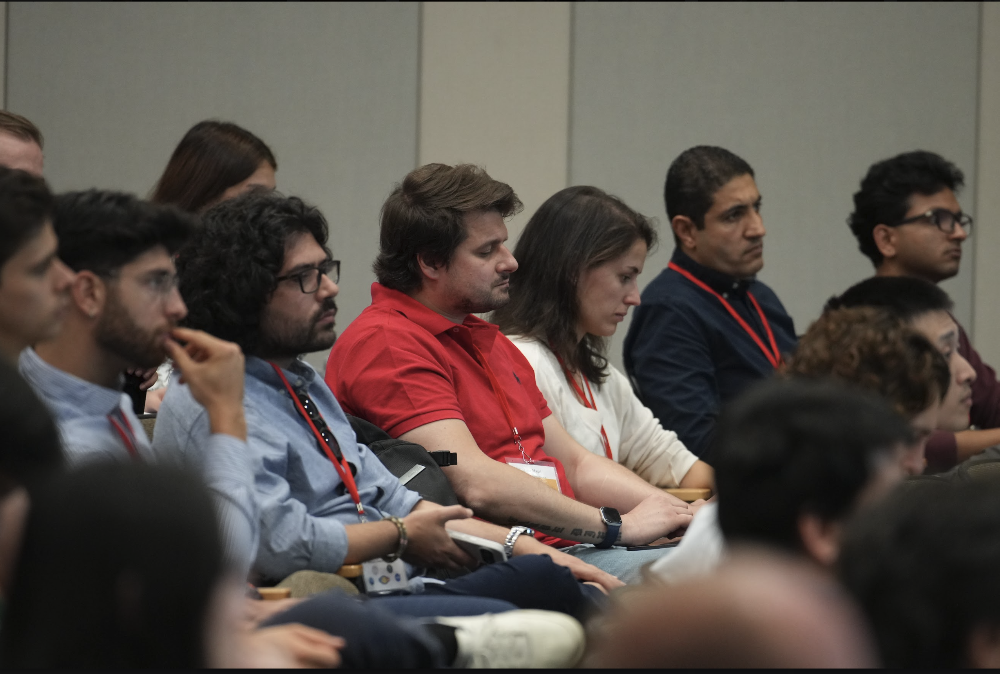
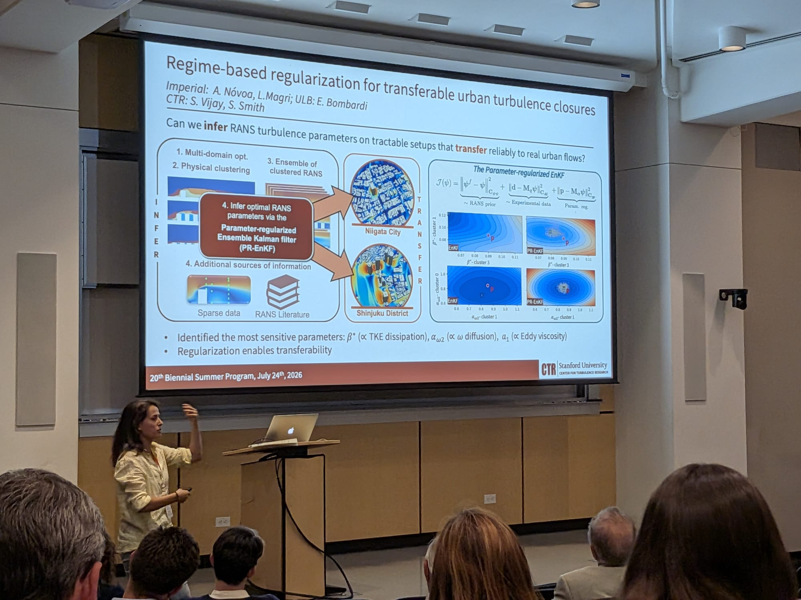
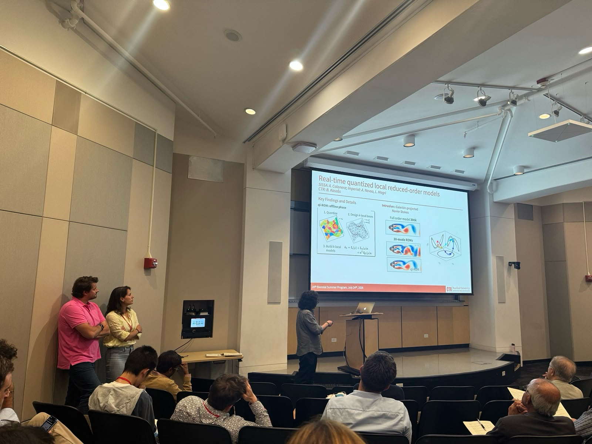
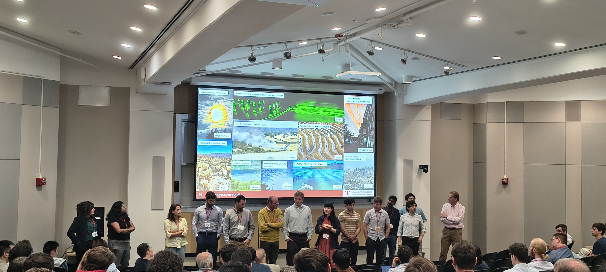
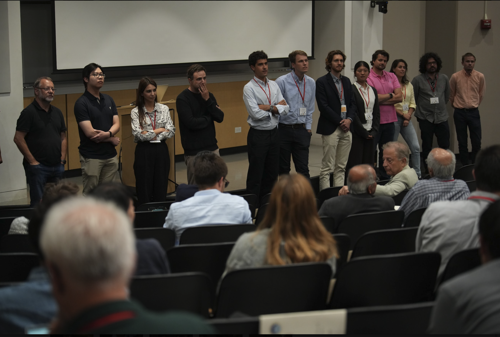

I spent a month as a visiting scholar at the Center for Turbulence Research (CTR), Stanford University, where I worked on two projects:

- **Real-time quantized local reduced-order models**. Bombardi, Nóvoa & Magri. Hosted at CTR by S. Smith. 
- **Regime-based regularization for transferable urban turbulence closures**. A. Colanera, A. Nóvoa & L. Magri. Hosted at CTR by B. Kázsas. 

  
  
  
  
  
  

