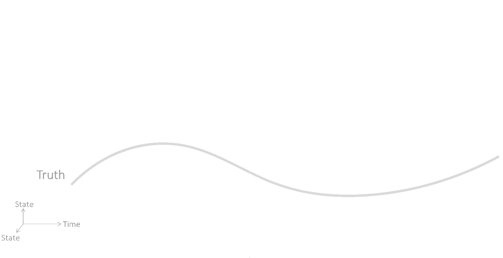

<div id="bibtex-source" style="display:none;">
@article{novoa2024inferring,
  title={Inferring unknown unknowns: Regularized bias-aware ensemble Kalman filter},
  author={N{\'o}voa, Andrea and Racca, Alberto and Magri, Luca},
  journal={Computer Methods in Applied Mechanics and Engineering},
  volume={418},
  pages={116502},
  year={2024},
  publisher={Elsevier}
}
</div>

#### Abstract

Because of physical assumptions and numerical approximations, low-order models are affected by uncertainties in the state and parameters, and by model biases. Model biases, also known as model errors or systematic errors, are difficult to infer because they are <em>unknown unknowns</em>, i.e., we do not necessarily know their functional form a priori. With biased models, data assimilation methods may be ill-posed because either 
- they are "bias-unaware" because the estimators are assumed unbiased, 
- they rely on an a priori parametric model for the bias, or 
- they can infer model biases that are not unique for the same model and data. 

First, we design a data assimilation framework to perform combined state, parameter, and bias estimation. Second, we propose a mathematical solution with a sequential method, i.e., the regularized bias-aware ensemble Kalman Filter (r-EnKF), which requires a model of the bias and its gradient (i.e., the Jacobian). Third, we propose an echo state network as the model bias estimator. We derive the Jacobian of the network, and design a robust training strategy with data augmentation to accurately infer the bias in different scenarios. Fourth, we apply the r-EnKF to nonlinearly coupled oscillators (with and without time-delay) affected by different forms of bias. The r-EnKF infers in real-time parameters and states, and a unique bias. The applications that we showcase are relevant to acoustics, thermoacoustics, and vibrations; however, the r-EnKF opens new opportunities for combined state, parameter and bias estimation for real-time and on-the-fly prediction in nonlinear systems.

---
#### Conceptual of sequential bias-aware data assimilation

<!--  -->


#### Citation


<div class="styled-quote">
Nóvoa, A., Racca, A., & Magri, L. (2024). Inferring unknown unknowns: Regularized bias-aware ensemble Kalman filter. Computer Methods in Applied Mechanics and Engineering, 418, 116502.
</div>


<!-- ```bibtex 
@article{novoa_inferring_2023,
  title={Inferring unknown unknowns: Regularized bias-aware ensemble Kalman filter},
  author={N{\'o}voa, Andrea and Racca, Alberto and Magri, Luca},
  journal={Computer Methods in Applied Mechanics and Engineering},
  volume={418},
  pages={116502},
  year={2023},
  publisher={Elsevier}
}
```
 -->
