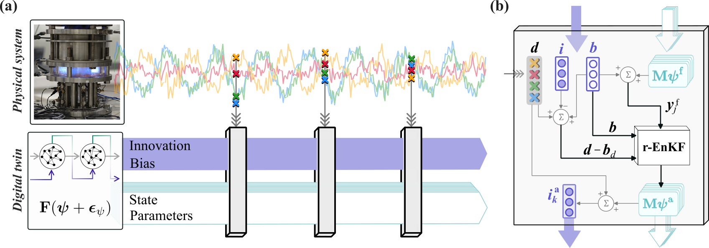

@article{novoa2024real,
  title={A real-time digital twin of azimuthal thermoacoustic instabilities},
  author={N{\'o}voa, Andrea and Noiray, Nicolas and Dawson, James R and Magri, Luca},
  journal={Journal of Fluid Mechanics},
  volume={1001},
  pages={A49},
  year={2024},
  publisher={Cambridge University Press}
}

#### Abstract

When they occur, azimuthal thermoacoustic oscillations can detrimentally affect the safe operation of gas turbines and aeroengines. 

We develop a real-time digital twin of azimuthal thermoacoustics of a hydrogen-based annular combustor, which combines two sources of information: 
1. A physics-based low-order model -- we derive a low-order thermoacoustic model for azimuthal instabilities, which is deterministic.
2. Raw and sparse experimental data from microphones, which contain both aleatoric noise and turbulent fluctuations. 
 
We derive an analytical solution of the bias-regularized ensemble Kalman filter (r-EnKF). The r-EnKF is a global solution of the data assimilation optimization problem which allows us to infer simultaneously and in real time:
1. The acoustic pressure (i.e., the physical state)
2. The model parameters
3. Systematic errors in the model (the bias) and on the measurement data (shift) -- we employ a reservoir computer to model the bias and the shift to close the assimilation equations. 

We demonstrate the proposed methodology by delivering a real-time digital twin of the azimuthal thermoacoustic dynamics of a laboratory hydrogen-based annular combustor for a variety of equivalence ratios. We find that 
- The real-time digital twin autonomously predicts azimuthal dynamics, in contrast to bias-unregularized methods.
- The r-EnKF acts as physics-based filter as it uncovers the physical acoustic pressure from the raw data.
- The thermoacoustic system is a time-varying parameter system -- while existing models have constant parameters and capture only slow-varying variables. 
- The digital twin generalizes to all equivalence ratios. 

This work opens new opportunities for real-time digital twinning of multi-physics problems.

#### Schematic of the proposed digital twin framework. 

<figcaption style="text-align:center;">(a) Physical and digital systems evolve independently. (b) Diagram of the r-EnKF update performed sequentially when measurement data become available.</figcaption>

---

#### Citation

Nóvoa A, Noiray N, Dawson JR, Magri L. A real-time digital twin of azimuthal thermoacoustic instabilities. Journal of Fluid Mechanics. 2024;1001:A49. doi:10.1017/jfm.2024.1052

---