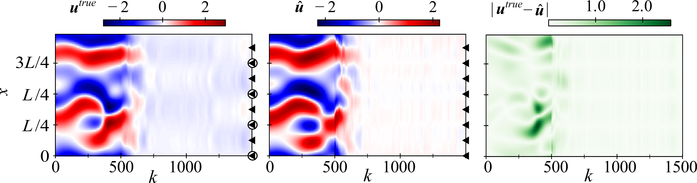

@article{10.1098/rspa.2025.0476,
    author = {Ozan, Defne E. and Nóvoa, Andrea and Rigas, George and Magri, Luca},
    title = {Data-assimilated model-informed reinforcement learning},
    journal = {Proceedings of the Royal Society A: Mathematical, Physical and Engineering Sciences},
    volume = {481},
    number = {2327},
    pages = {20250476},
    year = {2025},
    month = {12},
    issn = {1364-5021},
    doi = {10.1098/rspa.2025.0476},
    url = {https://doi.org/10.1098/rspa.2025.0476},
    eprint = {https://royalsocietypublishing.org/rspa/article-pdf/doi/10.1098/rspa.2025.0476/4404441/rspa.2025.0476.pdf},
}

#### Abstract

The control of spatio-temporal chaos is challenging because of high dimensionality and unpredictability. Model-free reinforcement learning (RL) discovers optimal control policies by interacting with the system, typically requiring observations of the full physical state. In practice, sensors often provide only partial and noisy measurements (observations) of the system. 

The objective of this paper is to develop a framework that enables the control of chaotic systems with partial and noisy observability. The proposed method, **data-assimilated model-informed RL (DA-MIRL)**, integrates: 
1. **Low-order models** to approximate high-dimensional dynamics.
2. **Sequential data assimilation (DA)** to correct model predictions in real-time.
3. **Off-policy actor-critic RL** to learn adaptive control strategies from corrected estimates.

We test DA-MIRL on the spatio-temporally chaotic solutions of the Kuramoto–Sivashinsky (KS) equation. We estimate the full state of the environment with two low-order models: 
- Physics-based model: a coarse-grained model of the KS 
- Data-driven model: the control-aware echo state network (ESN), which is proposed in this paper. 

We show that DA-MIRL successfully estimates and suppresses the chaotic dynamics of the environment in real time from partial observations and approximate models. This work opens opportunities for the control of partially observable chaotic systems.

----

#### Schematic of the proposed DA-MIRL. 
<!-- 
 -->

<figcaption style="text-align:center;">
The DA-MIRL aims to control a partially observed environment by integrating three components: model environment, state estimation,  and agent. The numerical model $\mathbf{F}$ approximates the environment by forecasting an ensemble of states $\mathbf{s}_j$ (stacked boxes). If there are no observations, the model runs autonomously, otherwise, the model prediction is updated by the state estimator. The state estimator perturbs the observations $\mathbf{o}$ and assimilates them with the forecast ensemble $\mathbf{s}_j^f$ via the EnKF, which results in the analysis ensemble $\mathbf{s}_j^a$⁠. The model $\mathbf{F}$ is re-initialized with $\mathbf{s}_j^a$. The actor-critic agent interacts with both the environment and its model to apply and determine the optimal action at any time $t_k$⁠. The critic, which is active only during training, approximates the $Q$-value function from the state-action pair. The actor (i.e. the policy $\boldsymbol{\pi}$⁠) determines the action $\mathbf{a}$ from the expected value of the full state of the environment. We do not have access to the environment’s full state, hence, we feed the expected value given by the model, i.e. the ensemble mean $\bar{s}$⁠.   </figcaption>

----

#### Control episode of the DA-MIRL with the control-aware ESN. 
<!-- 
 -->

<!-- 
 -->
<figcaption style="text-align:center;">
Spatio-temporal evolution of the environment ${\mathbf{u}}^{true}$ (i.e., the truth), the  model ensemble mean prediction $\hat{\mathbf{u}}$, and the reconstruction error. The triangles and circles indicate the location of the actuators and sensors, respectively⁠. The observations and actuations begin at time step $k=500$.</figcaption>

---

#### Citation

D. E. Ozan, A. Nóvoa, G. Rigas, L. Magri; Data-assimilated model-informed reinforcement learning. Proc. A 1 December 2025; 481 (2327): 20250476. doi: 10.1098/rspa.2025.0476

---