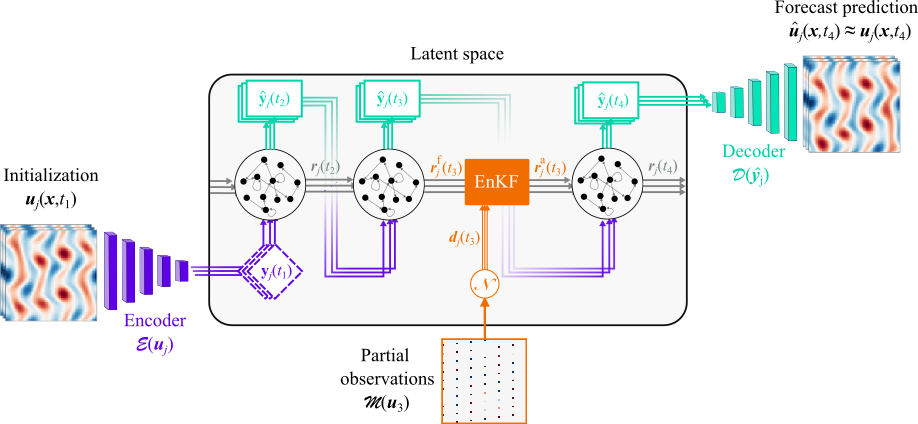

@article{OZALP2026118600,
title = {Real-time forecasting of chaotic dynamics from sparse data and autoencoders},
journal = {Computer Methods in Applied Mechanics and Engineering},
volume = {450},
pages = {118600},
year = {2026},
issn = {0045-7825},
doi = {https://doi.org/10.1016/j.cma.2025.118600},
url = {https://www.sciencedirect.com/science/article/pii/S0045782525008722},
author = {Elise Özalp and Andrea Nóvoa and Luca Magri},
keywords = {Autoencoder, Echo state network, Chaos, Data assimilation},
}

#### Abstract
The real-time prediction of chaotic systems requires a nonlinear-reduced order model (ROM) to forecast the dynamics, and a stream of data from sensors to update the ROM. Data-driven ROMs are typically built with a two-step strategy: data compression onto a lower-dimensional latent space, and prediction of the temporal dynamics on it. Although these methods have proven effective, to achieve real-time prediction, there are two key challenges to overcome: 
1. ROMs of chaotic systems can become numerically unstable; 
2. sensors’ data are sparse, i.e., partial, and noisy, and

To overcome these challenges, we propose an augmented sequential data assimilation (DA) framework based on the Ensemble Kalman filter (EnKF) that updates the latent state of ROM by assimilating noisy and sparse measurements. We demonstrate the proposed DA-ROM framework using a ROM that consists of a convolutional autoencoder (CAE) to compresses the system’s state onto a lower-dimensional latent space, and an echo state network (ESN) formulated as a state-space model to forecast the temporal evolution on the latent space. 

The DA-CAE-ESN provides a numerically stable and real-time adaptive ROM. The DA-CAE-ESN is tested on spatio-temporally chaotic partial differential equations: the Kuramoto–Sivashinsky equation, and a two-dimensional Navier-Stokes equation (Kolmogorov flow). We show that the method provides accurate and stable forecasts across different levels of noise, sparsity, and sampling rates. As a by-product, the DA-CAE-ESN acts as a localization strategy that mitigates spurious correlations, which arise when applying the EnKF to high-dimensional systems. The DA-CAE-ESN provides a numerically stable method to perform real-time predictions, which opens opportunities for deploying data-driven latent models.

----

#### Schematic of the proposed DA-CAE-ESN. 
<!-- 
 -->

<figcaption style="text-align:center;">
Illustration of the proposed DA-CAE-ESN framework, which integrates a convolutional autoencoder, an echo state network and an ensemble Kalman filter with Kolmogorov flow data.  The CAE encodes an ensemble of initial snapshots into a latent state $\mathbf{y}$ at a time $t_1$ via the encoder $\mathcal{E}$. 
    In the latent space, the ESN forecasts in closed-loop an ensemble of predicted latent states $\mathbf{\hat{y}}(t_j)$ until observations become available (here, for illustration at $t=t_3$). Then, the EnKF combines the partial and noisy observations $\mathbf{d}$ with the ensemble of reservoir states $\mathbf{r}_j^f$, resulting in the analysis ensemble $\mathbf{r}^a(t_j)$. The updated ESN can continue to forecast in closed-loop. The decoder $\mathcal{D}$ recovers the prediction of the full flow field $\mathbf{\hat{u}}(t_j)$ from any $\mathbf{\hat{y}}(t_j)$ (here, for illustration at $t=t_4$). 
  </figcaption>

----

#### Citation

Özalp, E., Nóvoa, A., & Magri, L. (2025). Real-time forecasting of chaotic dynamics from sparse data and autoencoders. Computer Methods in Applied Mechanics and Engineering, 450, 118600. doi: 10.1016/j.cma.2025.118600.  

---