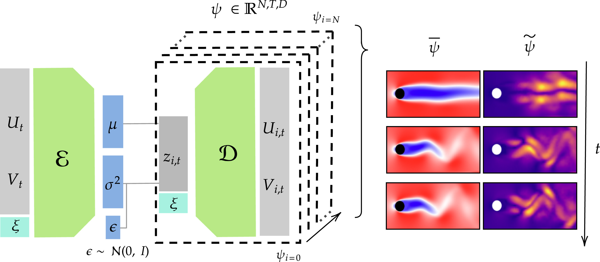

@article{ZIGHED2026107250,
title = {Efficient adaptation of ROMs for unsteady flows using data assimilation},
journal = {Computers & Fluids},
pages = {107250},
year = {2026},
issn = {0045-7930},
doi = {10.1016/j.compfluid.2026.107250},
url = {https://doi.org/10.1016/j.compfluid.2026.107250},
author = {Ismaël Zighed and Andrea Nóvoa and Luca Magri and Taraneh Sayadi},
keywords = {Reduced-order model, Variational autoencoder, Transformer, Data assimilation},
}

#### Abstract

Reduced-order models (ROMs) of unsteady flows lose accuracy when they are deployed outside the regimes they were trained on, and retraining them from scratch is computationally expensive. The objective of this paper is to **adapt a parameterized ROM to out-of-sample regimes in real time, using only sparse observations of the full system**.

The proposed ROM has an encode-process-decode structure:
1. A **variational autoencoder (VAE)** performs the dimensionality reduction. Because it is probabilistic, it naturally samples ensembles of trajectories, which provide both a predictive mean and uncertainty quantification.
2. A **transformer network** evolves the latent states, exploiting attention to capture temporal dependencies and the effect of the parameter.
3. The ROM is **parameterized by an external control variable** — the Reynolds number in the Navier-Stokes setting.

After an initial training on a limited set of dynamical regimes, the model is adapted to out-of-sample parameter regions using sparse data only. The probabilistic formulation supports ensemble generation, which we employ within an **ensemble Kalman filter** to assimilate data and reconstruct full-state trajectories from minimal observations.

We further show that, for the dynamical system considered, the dominant source of error in out-of-sample forecasts stems from *distortions of the latent manifold* rather than from changes in the latent dynamics. Consequently, retraining can be limited to the variational autoencoder. This yields a lightweight, computationally efficient, real-time adaptation procedure, which attains an accuracy comparable to full retraining at a fraction of the computational cost.

----

#### Schematic of the parameterized VAE-transformer ROM. 

<figcaption style="text-align:center;">
The variational encoder $\mathcal{E}$ compresses the velocity field $(U_t, V_t)$, together with the parameter $\xi$, into the mean $\mu$ and variance $\sigma^2$ of the latent distribution. Sampling $\epsilon \sim \mathcal{N}(0, I)$ yields an ensemble of latent states $z_{i,t}$, which the decoder $\mathcal{D}$ maps back to an ensemble of full-state trajectories $\psi \in \mathbb{R}^{N,T,D}$. On the right, the ensemble mean $\bar{\psi}$ and the ensemble spread $\tilde{\psi}$ of the flow past a cylinder are shown at increasing times $t$; the spread grows as the forecast departs from the observations, which provides the uncertainty estimate that the ensemble Kalman filter exploits.
  </figcaption>

----

#### Citation

Zighed, I., Nóvoa, A., Magri, L., & Sayadi, T. (2026). Efficient adaptation of ROMs for unsteady flows using data assimilation. Computers & Fluids, 107250. doi: 10.1016/j.compfluid.2026.107250.  

---
