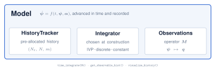
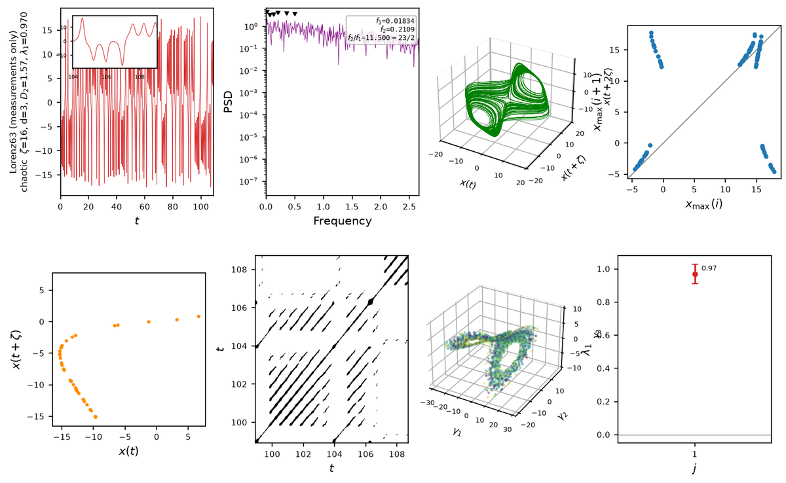
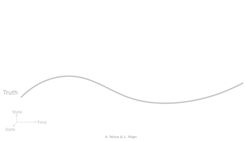
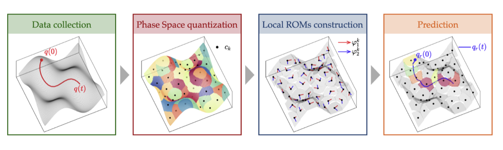

Four Python packages, each with its own documentation and executed tutorial
notebooks. The tutorials are embedded below: open one to work through it without
leaving this page, or follow the link to the full documentation.

  

    <h2 class="project-name">dynamodels</h2>
    
Dynamical-system models behind one interface. A <code>Model</code> couples a governing equation to a pre-allocated state history and a pluggable time integrator: three low-order oscillators, two spatially extended PDEs, and the Lorenz systems.

    
    <ul class="project-links">
      <li><a href="https://andreanovoa.github.io/dynamodels/" target="_blank" rel="noopener noreferrer">Documentation</a></li>
      <li><a href="https://github.com/andreanovoa/dynamodels" target="_blank" rel="noopener noreferrer">GitHub</a></li>
    </ul>
    

      
Interactive tutorial

      <iframe class="project-embed" src="https://andreanovoa.github.io/dynamodels/tutorials/" loading="lazy" title="dynamodels tutorials"></iframe>
    

  

  

    <h2 class="project-name">ntsa</h2>
    
Nonlinear time-series analysis of a dynamical system from a single long trajectory: delay embedding, Lyapunov exponents, and classification of the dynamical regime. The same pipeline runs from measured data alone, with no model equations.

    
    <ul class="project-links">
      <li><a href="https://andreanovoa.github.io/ntsa/" target="_blank" rel="noopener noreferrer">Documentation</a></li>
      <li><a href="https://github.com/andreanovoa/ntsa" target="_blank" rel="noopener noreferrer">GitHub</a></li>
    </ul>
    

      
Interactive tutorial

      <iframe class="project-embed" src="https://andreanovoa.github.io/ntsa/tutorials/" loading="lazy" title="ntsa tutorials"></iframe>
    

  

  

    <h2 class="project-name">romda</h2>
    
Real-time reduced-order modelling and bias-aware data assimilation: ensemble Kalman filters including the regularized bias-aware EnKF, physical and data-driven forecast models, bias estimators, and POD and SPOD decompositions.

    
    <ul class="project-links">
      <li><a href="https://andreanovoa.github.io/real-time-bias-aware-DA/" target="_blank" rel="noopener noreferrer">Documentation</a></li>
      <li><a href="https://github.com/andreanovoa/real-time-bias-aware-DA" target="_blank" rel="noopener noreferrer">GitHub</a></li>
    </ul>
    

      
Interactive tutorial

      <iframe class="project-embed" src="https://andreanovoa.github.io/real-time-bias-aware-DA/tutorials/" loading="lazy" title="romda tutorials"></iframe>
    

  

  

    <h2 class="project-name">qlroms</h2>
    
Quantized-local reduced-order models. The state space is partitioned into charts by k-means, each chart gets its own local POD basis, and an exact shared atlas stitches them into one global coordinate system, with the local dynamics advanced by an intrusive Galerkin projection.

    
    <ul class="project-links">
      <li><a href="https://andreanovoa.github.io/qlroms/" target="_blank" rel="noopener noreferrer">Documentation</a></li>
      <li><a href="https://andreanovoa.github.io/qlroms/demo/ks1d/" target="_blank" rel="noopener noreferrer">Live demo</a></li>
    </ul>
    

      
Live demo: move K and r, and watch the charts and the forecast change

      <iframe class="project-embed" src="https://andreanovoa.github.io/qlroms/demo/ks1d/" loading="lazy" title="qlroms live demo"></iframe>
    

    

      
Interactive tutorial

      <iframe class="project-embed" src="https://andreanovoa.github.io/qlroms/tutorials/" loading="lazy" title="qlroms tutorials"></iframe>
    

  

