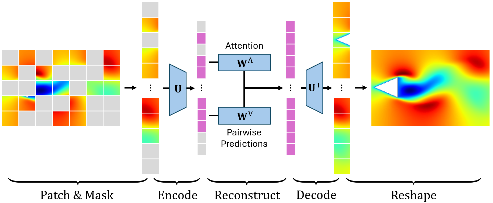

#### Abstract

Vision transformers have shown outstanding performance in image generation, yet their adoption in fluid dynamics remains limited. We introduce the **Latent Attention on Masked Patches (LAMP)** model, an interpretable regression-based modified vision transformer designed for masked flow reconstruction.

LAMP follows a three-fold strategy:
1. **Patching**: each flow snapshot is partitioned into patches.
2. **Compression**: patch-wise dimensionality reduction via proper orthogonal decomposition.
3. **Reconstruction**: the full field is recovered from a masked input with a single-layer transformer, which is trained via closed-form linear regression.

We test the method on two canonical 2D unsteady wakes: a laminar wake past a bluff body, and a chaotic wake past two cylinders.

- On the **laminar** case, LAMP accurately reconstructs the full flow field from a 90%-masked and noisy input, across signal-to-noise ratios between 10 and 30 dB. Further, the learned attention matrix yields interpretable multi-fidelity **optimal sensor-placement maps**.
- On the **chaotic** wake, LAMP's performance is limited, but it outperforms other regression methods such as gappy POD.

The modularity of the framework naturally accommodates nonlinear compression and deep attention blocks, thereby providing an efficient baseline for nonlinear, high-dimensional masked flow reconstruction.

----

#### Schematic of the LAMP model. 

<figcaption style="text-align:center;">
The LAMP pipeline. <b>Patch &amp; mask</b>: the flow snapshot is split into patches, of which only a small fraction is observed (the grey patches are masked). <b>Encode</b>: each patch is projected onto its POD basis $\mathbf{U}$, which gives the latent patch tokens. <b>Reconstruct</b>: a single attention layer combines the attention matrix $\mathbf{W}^{\mathrm{A}}$ with the pairwise predictions $\mathbf{W}^{\mathrm{V}}$ to infer the latent tokens of the masked patches from the observed ones. <b>Decode &amp; reshape</b>: the inferred tokens are mapped back to physical space with $\mathbf{U}^{\mathsf{T}}$ and reassembled into the full flow field.
  </figcaption>
